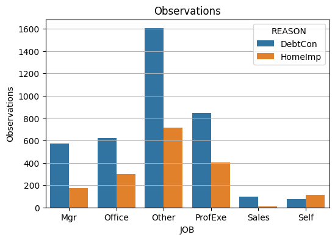

# Home Loan Default and Loss Amount Prediction


Photo by <a href="https://unsplash.com/@kapischka?utm_source=unsplash&utm_medium=referral&utm_content=creditCopyText">Paul Kapischka</a>


## Requirements

- Python 3.10
- venv

## Setup steps

```
python -m venv venv

souce venv/bin/activate

pip install -r requirements.txt
```

## Setup Instructions for various scripts

1. [EDA](TODO)
2. [Tree Models](TODO)
3. [Linear Models](TODO)
4. [Model Comparison](TODO)


## Table of Contents
1. [Abstract](#abstract)

2. [Data Preparation and EDA](#data-preparation-and-eda)

3. [Comparing Tree Models](#comparing-tree-models)

4. [Comparing Linear Models](#comparing-linear-models)

5. [Comparing Neural Networks and All Models](#comparing-neural-networks-and-all-models)

5. [Conclusion and future works](#conclusion-and-future-works)

- [Built with](#built-with)
- [Author](#author)

## Abstract

This repository provides a concise overview of working with the [HMEQ dataset](https://www.kaggle.com/datasets/ajay1735/hmeq-data) to predict loan defaults and estimate loss amounts when defaults occur. The process includes data preparation, exploratory data analysis (EDA), and model comparisons using various techniques, including tree models, linear models with different variable selection methods, and neural networks. Each section is covered in separate scripts for easy reference.

---

## Data Preparation and EDA

### Data Preparation

In the data preparation phase, we have performed the following key steps:

1. **Handling Missing Values:**
   - For the reason for loan (REASON) and current job (JOB) columns, we imputed missing values as "Unknown" to ensure data integrity.
   - For missing numerical values in other columns, we applied imputation by replacing them with the median value of their respective columns. To keep track of imputed values, a flag variable was created.

2. **Creating Dummy Variables:**
   - To facilitate modeling with categorical variables, we generated dummy variables for categorical columns. This transformation allows us to use these variables effectively in machine learning models.

3. **Capping Loss Amounts:**
   - Observing outliers in the loss amount (TARGET_LOSS_AMT) column, we capped the loss values at $25,000. This step helps mitigate the influence of extreme values on our models and analysis.

4. **Default and Loss Statistics:**
   - Out of the 5,960 loans in the dataset, 20% experienced defaults.
   - After capping the loss amount, the average loss per defaulted loan was calculated to be approximately $12,118 with a standard deviation of $7,574.

These data preparation steps ensure that our dataset is well-prepared for further analysis and model building, with missing values handled, categorical variables encoded, and outliers addressed.

### EDA
Although sample sizes are small, self-workers and salespeople have high risks. Self-workers had an average default rate of 44% when the loan was for debt consolidation (DebtCon). This loan was also the second-highest average loss amount of over $20,000. Salespeople have shown a high risk in both debt consolidation and home improvement (HomeImpImp) loans, with an average default rate of 35% and 33%.

|  |  |
|:---:|:---:|
| Average default rate | Average loss amount in USD |
|  |  |
| Expected loss value in USD | Observation count |
---

Delinquencies on credit reports (DELINQ) had the highest positive correlation to defaulting at 35%, and credit line age (CLAGE) had the highest negative correlation at -17%. These two are modest correlations at best, so looking into the data further would be essential. Also, we have an imbalance in the number of observations for each job since we have many “Other” and very few “Sales” and “Self.”


---

## Comparing Tree Models
We've compared three tree-based; models, Decision Trees (DT), Random Forests (RF), and Gradient Boosting (GB), to predict 1) the probability of a loan default and 2) the loss amount when the loan defaults.

The debt-to-income ratio was the feature that appeared frequently in predicting the default for all models, and the loan amount was the most important for predicting the loss amount on the loan. These findings make sense because a high debt-to-income ratio will increase the likelihood of not paying the bills, and the higher the loan, the higher the possibility of having a high loss amount.

|  |  |  |
|:---:|:---:|:---:|
| Image 1 Caption | Image 2 Caption | Image 3 Caption |
|  |  |  |
| Image 4 Caption | Image 5 Caption | Image 6 Caption |
|  |  |  |
| Image 7 Caption | Image 8 Caption | Image 9 Caption |

---

## Comparing Linear Models

---

## Comparing Neural Networks and All Models

---

## Conclusion and future works

---

## Built With

* **Software Packages:**  [Python](https://www.python.org/), [Numpy](https://numpy.org/), [Pandas](https://pandas.pydata.org/docs/), [Scikit Learn](https://scikit-learn.org/), [Tensor Flow](https://www.tensorflow.org/)

## Author

* **Takeshi Sugiyama** - *Data Scientist*
  * [Linkedin](https://www.linkedin.com/in/takeshi-sugiyama/)
  * [Tableau](https://public.tableau.com/profile/takeshi.sugiyama)
