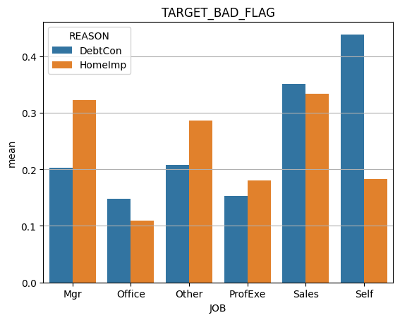
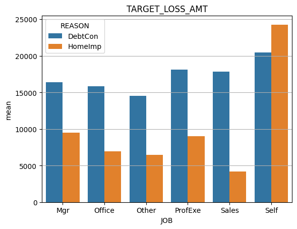
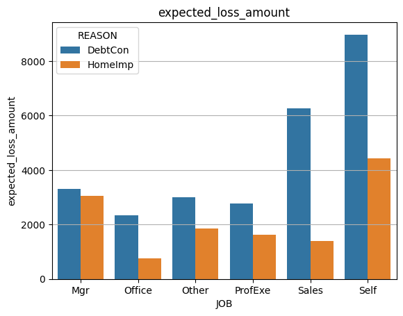
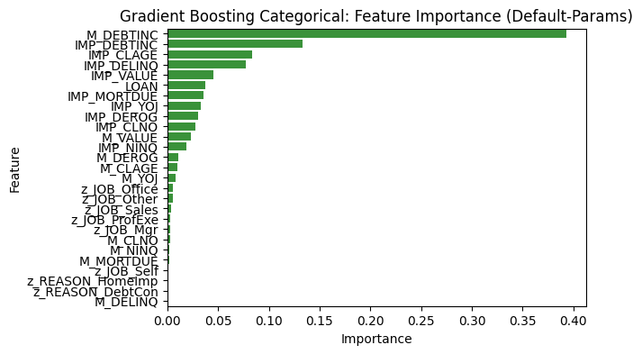
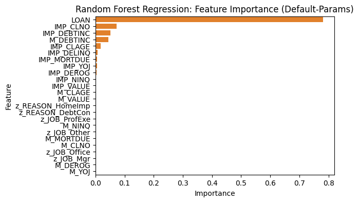
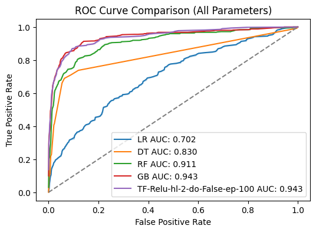
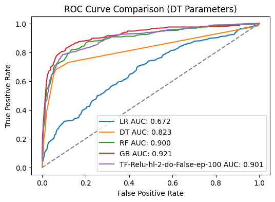
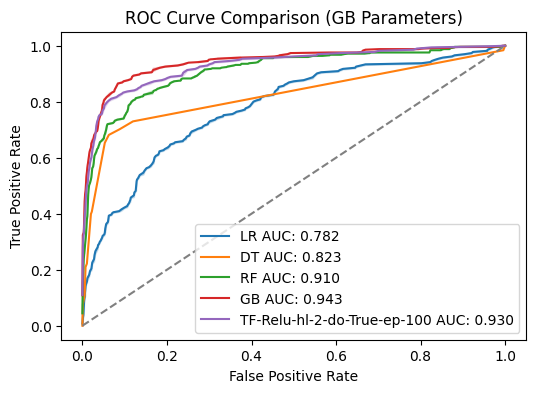

# Home Loan Default and Loss Amount Prediction


Photo by <a href="https://unsplash.com/@kapischka?utm_source=unsplash&utm_medium=referral&utm_content=creditCopyText">Paul Kapischka</a>


## Requirements

- Python 3.10
- venv

## Setup steps

```
python -m venv venv

source venv/bin/activate

pip install -r requirements.txt
```

<!-- ## Setup Instructions for various scripts

1. [EDA](TODO)
2. [Tree Models](TODO)
3. [Linear Models](TODO)
4. [Model Comparison](TODO) -->


## Table of Contents
1. [Abstract](#abstract)

2. [Data Preparation and EDA](#data-preparation-and-eda)

3. [Comparing Tree Models](#comparing-tree-models)

4. [Comparing Linear Models](#comparing-linear-models)

5. [Comparing Neural Networks and All Models](#comparing-neural-networks-and-all-models)

5. [Conclusion and future works](#conclusion-and-future-works)

- [Built with](#built-with)
- [Author](#author)

## Abstract

This repository provides a concise overview of working with the [HMEQ dataset](https://www.kaggle.com/datasets/ajay1735/hmeq-data) to predict loan defaults and estimate loss amounts when defaults occur. The process includes data preparation, exploratory data analysis (EDA), and model comparisons using various techniques, including tree models, linear models with different variable selection methods, and neural networks. Each section is covered in separate scripts for easy reference.

---

## Data Preparation and EDA

### Data Preparation

In the data preparation phase, we have performed the following key steps:

1. **Handling Missing Values:**
   - For the reason for loan (REASON) and current job (JOB) columns, we imputed missing values as "Unknown" to ensure data integrity.
   - For missing numerical values in other columns, we applied imputation by replacing them with the median value of their respective columns. To keep track of imputed values, a flag variable was created.

2. **Creating Dummy Variables:**
   - To facilitate modeling with categorical variables, we generated dummy variables for categorical columns. This transformation allows us to use these variables effectively in machine learning models.

3. **Capping Loss Amounts:**
   - Observing outliers in the loss amount (TARGET_LOSS_AMT) column, we capped the loss values at $25,000. This step helps mitigate the influence of extreme values on our models and analysis.

4. **Default and Loss Statistics:**
   - Out of the 5,960 loans in the dataset, 20% experienced defaults.
   - After capping the loss amount, the average loss per defaulted loan was calculated to be approximately $12,118 with a standard deviation of $7,574.

These data preparation steps ensure that our dataset is well-prepared for further analysis and model building, with missing values handled, categorical variables encoded, and outliers addressed.

### EDA
Although sample sizes are small, self-workers and salespeople have high risks. Self-workers had an average default rate of 44% when the loan was for debt consolidation (DebtCon). This loan was also the second-highest average loss amount of over $20,000. Salespeople have shown a high risk in both debt consolidation and home improvement (HomeImpImp) loans, with an average default rate of 35% and 33%.

|  |  |
|:---:|:---:|
| Average default rate | Average loss amount in USD |
|  |  |
| Expected loss value in USD | Observation count |
---

Delinquencies on credit reports (DELINQ) had the highest positive correlation to defaulting at 35%, and credit line age (CLAGE) had the highest negative correlation at -17%. These two are modest correlations at best, so looking into the data further would be essential. Also, we have an imbalance in the number of observations for each job since we have many “Other” and very few “Sales” and “Self.”


---

## Comparing Tree Models
We've compared three tree-based; models, Decision Trees (DT), Random Forests (RF), and Gradient Boosting (GB), to predict 1) the probability of a loan default and 2) the loss amount when the loan defaults. The parameters shown here are results using default parameters. The Grid Search results have slightly better results and can be observed in the [log file](logs/2-tree-models-GS-Params-2023-09-21_00:34.log) and the [img](img/2-tree-models/GS-Params) folder.

### Important Features
The debt-to-income ratio was the feature that appeared frequently in predicting the default for all models, and the loan amount was the most important for predicting the loss amount on the loan. These findings make sense because a high debt-to-income ratio will increase the likelihood of not paying the bills, and the higher the loan, the higher the possibility of having a high loss amount.

|  |  |  |
|:---:|:---:|:---:|
| Decision Tree Default Risk | Random Forest Default Risk | Gradient Boosting|
|  |  |  |
| Decision Tree Loss Amount | Random Forest Loss Amount | Gradient Boosting Loss Amount |

### Decision Tree Results
Decision trees help us understand how the model processes data and predict predictions. The debt-to-income ratio and the loan amount are at the top of the decision tree (root node) for predicting default and loss amounts. Features in the root node indicate that these features play a crucial role in splitting the groups to make a prediction.

|  |  |
|:---:|:---:|
| Default Risk Graphn | Loss Amount Graph |

### Tree Model Results
For each model, I compared the area under the curve (AUC) for predicting default risk and root mean square error (RMSE) for predicting the loss amount. Table 1 shows the results. In terms of performance, we observe that Gradient Boosting outperformed the rest for both predictions.

| Model | Default Risk AUC Score | RMSE Test (Mean Loss Amount = $11,573) |
|:---:|:---:|:---:|
| Decision Tree | 0.82 | $4,545 |
| Random Forest | 0.89| $3,875 |
| Gradient Boosting | 0.94 | $1,931 |


---

## Comparing Linear Models
I’ve applied logistic and linear regression models to the HMEQ data by using different variables. I’ve used the logistic regression model to predict the probability of a loan default and applied the linear regression model to predict the loss amount when the loan defaults. I filtered out variables with feature importance scores less than 0.05 for tree-based models. I also capped the maximum number of variables for stepwise selection to 10.

### Logistic Regression
The stepwise selection method had the best results for the logistic regression (default risk) model. However, the stepwise selection method used 10 variables compared to 3 to 5 variables selected from tree-based models with similar results.


| Variables Selection | Variable # |
|:---:|:---:|
| All | 27 |
| Decision Tree | 3 |
| Random Forest | 5 |
| Gradient Boosting | 4 |
| Stepwise Selection | 10 |

### Linear Regression
For the linear regression (loss amount) model, the stepwise selection method also performed the best using 10 variables.

| Variable Selection | Variable # | RMSE Train (Error Rate): Mean Loss Amount = $12,255 | RMSE Test (Error Rate): Mean Loss Amount = $11,573 |
|:---:|:---:|:---:|:---:|
| All | 27 | $3,226 (26.3%) | $3,362 (29.0%) |
| Decision Tree | 3 | $4,380 (35.7%) | $4,441 (38.4%) |
| Random Forest | 1 | $5,122 (41.8%) | $5,147 (44.5%) |
| Gradient Boosting | 3 | $4,094 (33.4%) | $4,022 (34.8%) |
| Stepwise Selection | 10 | $3,335 (27.2%) | $3,316 (28.7%) |

### Stepwise Selection Results
The stepwise process for selecting variables are shown below. The logistic and linear regression scoring methods are ROCAUC and negative root mean square, respectively. The performance starts to plateau for both models somewhere between the 4th and 8th variables. With the visualization, we can imply that the logistic regression model can perform well with a few variables. Still, the linear regression model may require more variables.

|  |  |
|:---:|:---:|
| Default Risk Stepwise Selection | Loss Amount Selection Selection |

### Coefficient Analysis
The coefficients created using the Decision Tree variables are shown below. Each model have 3 variables.

| Logistic Regression (Default risk) |  | Linear Regression (Loss amount) | |
|:----------------:|:----------------:|:---------------------:|:----------------:|
| Variable | Coefficient | Variable | Coefficient |
| Intercept | -5.95 | Intercept | -2,326.94 |
| Delinquencies | 0.67 | Loan amount | 0.44 |
| Modified flag variable for debt to income ratio | 2.84 | Number of credit lines | 214.74 |
| Debt to income ratio | 0.09 | Debt to income ratio | 69.79 |

The coefficients in these two functions make sense because all variables are considered potential risk factors when giving out loans. The modified flag variable for debt to income ratio (DEBTINC) in the logistic regression would require some context. This flag variable was created as an indicator when I replaced the missing values for DEBTINC with the median value based on the profession and loan reason. It was interesting to see this variable as an important feature, and it makes sense too because the user may not want to provide their DEBTINC because it probably wasn’t a desirable one.

---

## Comparing Neural Networks and All Models
I’ve applied five different models for classification and regression on the HMEQ data— Linear/Logistic Regression (LR), Decision Tree (DT), Random Forest (RF), Gradient Boosting (GB), and Neural Networks created with Tensorflow (TF). I’ve run three different variable selection techniques for each model to compare the results against the model built using all variables. The variable selection is based on the feature importance scores above 0.005 from DT, RF, and GB. On top of the variable selection methods, I’ve compared 12 variations for the TF model by using three different activations, 1 or 2 hidden layers, and with or without dropout layers. In total, I’ve created 64 models for the classification task and another 64 for the regression task. I’ve applied the classification model to asses the default risk of a loan and the regression model to predict the loss amount when the loan defaults.

### Classification Model Comparison
Applying variable selection methods had positive results for most models for the classification task. The figures below compares the AUC for models with and without variable selections. The best TF model is represented in the figure. The table summarizes the number of variables, best accuracy, and best AUC model.

|  |  |
|:---:|:---:|
| All variables | Decision Tree Variables |
|  |  |
| Random Forest Variables | Gradient Boosting Variables |

| Variable Selection | Variable Count | Best Accuracy Model | Best AUC Model |
| -------- | -------- | -------- | -------- |
| All | 27 | RF: 0.922 | RF: 0.970 |
| Decision Tree | 11 | RF: 0.906 | RF: 0.935 |
| Random Forest | 13 | TF: 0.905 | GB: 0.924 |
| Gradient Boosting | 17 | RF: 0.911 | RF: 0.957 |

Overall, RF had the best results in most cases. The model with the best AUC score was the RF model using all variables. The RF model using less variables, such as GB, had similar results when using all variables.

### Regression Model Comparison
The summary of the RMSE for the loss amount is in the table below. The error rate are in parenthesis and is calculated from the mean loss amount of the test data of $11,573. Overall, GB performed the best in all cases. The simple DT model using RF variables did fairly well, using only 8 variables.


|Variable Selection  | Variable Count | RMSE: LR | RMSE: DT | RMSE: RF | RMSE: GB | RMSE: TF |
|----------|----------|----------|----------|----------|----------|----------|
| All | 27 | $3,362 (29.0%) | $3,191 (27.5%) | $2,251 (19.4%) | **$1,936 (16.7%)** | $2,811 (24.3%) |
| DT | 7 | $3,762 (32.5%) | $3,356 (29.0%) | $2,241 (19.4%) | **$2,091 (18.1%)** | $3,581 (30.9%) |
| RF | 8 | $3,600 (31.1%) | $2,790 (24.1%) | $2,859 (24.7%)| **$2,043 (17.7%)** | $2,333 (20.2%) |
| GB | 9 | $3,408 (29.4%) | $2,763 (23.9%) | $2,139 (18.5%) | **$1,654 (14.3%)** | $3,370 (29.1%) |


---

## Conclusion and future works
Throughout this project, I explored how different variable selection models, including DT, RF, GB, Stepwise selection, and the inclusion of all variables, impacted the results of our predictive models. The diverse set of models provided valuable insights into the data's behavior and the predictive performance of each algorithm.

Both LR and DT offer high interpretability, making them particularly advantageous when interpretability is crucial and performance differences are minimal. For classification tasks, RF demonstrated commendable performance, while GB excelled in regression models.

In terms of practical implementation, I recommend using the LR model with Stepwise variable selection for default risk prediction and the DT model with GB variables for loss amount prediction. These models stood out for their simplicity, involving only 9-10 variables, reliable performance, ease of interpretation, and swift implementation across various programming languages.

For future works, I intend to explore ensemble techniques, such as stacking or bagging, to leverage the diverse strengths of LR, DT, RF, and GB. This exploration will be complemented by an in-depth hyperparameter tuning analysis for Random Forests and Gradient Boosting models to uncover potential performance gains. Additionally, I plan to delve into advanced feature engineering techniques, creating new features or transforming existing ones to capture underlying data patterns more effectively.

---

## Built With

* **Software Packages:**  [Python](https://www.python.org/), [Numpy](https://numpy.org/), [Pandas](https://pandas.pydata.org/docs/), [Scikit Learn](https://scikit-learn.org/), [Tensor Flow](https://www.tensorflow.org/)

## Author

* **Takeshi Sugiyama** - *Data Scientist*
  * [Linkedin](https://www.linkedin.com/in/takeshi-sugiyama/)
  * [Tableau](https://public.tableau.com/profile/takeshi.sugiyama)
